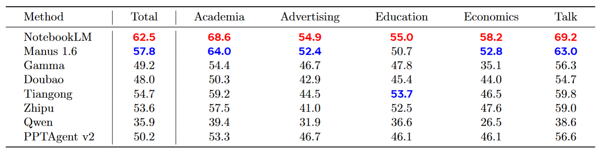

<h2 align="center" style="font-size: 2.5em; font-weight: bold;">
  PresentBench: A Fine-Grained Rubric-Based Benchmark for Slide Generation
</h2>

<p align="center">
  <a href="https://presentbench.github.io/" style="margin: 0 10px;">🌐 Homepage</a> |
  <a href="https://huggingface.co/datasets/PresentBench/PresentBench" style="margin: 0 10px;">🤗 Datasets</a> |
  <a href="https://arxiv.org/pdf/2603.07244" style="margin: 0 10px;">📖 Paper</a>
</p>

This repository contains the evaluation code for the paper *[PresentBench: A Fine-Grained Rubric-Based Benchmark for Slide Generation](https://presentbench.github.io/)*.

---


## 📄 Abstract

Slides serve as a critical medium for conveying information in presentation-oriented scenarios such as academia, education, and business. Despite their importance, creating high-quality slide decks remains time-consuming and cognitively demanding. Recent advances in generative models, such as Nano Banana Pro, have made automated slide generation increasingly feasible. However, existing evaluations of slide generation are often coarse-grained and rely on holistic judgments, making it difficult to accurately assess model capabilities or track meaningful advances in the field. In practice, the lack of fine-grained, verifiable evaluation criteria poses a critical bottleneck for both research and real-world deployment.

In this paper, we propose PresentBench, a fine-grained, rubric-based benchmark for evaluating automated real-world slide generation. It contains 238 evaluation instances, each supplemented with background materials required for slide creation. Moreover, we manually design an average of 54.1 checklist items per instance, each formulated as a binary question, to enable fine-grained, instance-specific evaluation of the generated slide decks.

Extensive experiments show that PresentBench provides more reliable evaluation results than existing methods, and exhibits significantly stronger alignment with human preferences. Furthermore, our benchmark reveals that NotebookLM significantly outperforms other slide generation methods, highlighting substantial recent progress in this domain.


## 💡 Why PresentBench?

1. Instance-Specific, Fine-Grained Criteria

    Existing evaluation frameworks often adopt instance-agnostic scoring schemes, typically relying on a judging paradigm that poses the same set of general questions for all slide decks. Such evaluations fail to account for instance-specific content, making it difficult to assess if a slide generation system truly follows the intended input.

    PresentBench establishes **fine-grained** checklist items **tailored to each slide deck instance**. On average, each instance is associated with more than 50 specifically designed atomic evaluation items, converting vague qualitative grading into **verifiable** binary checks.

2. Authentic, Grounded Scenarios

    A large portion of prior work focuses on isolated subtasks or reference-free settings without grounding the task in concrete background materials. This creates a mismatch between evaluation settings and real-world usage.

    For each instance in PresentBench, we curate authoritative background materials, such as top-tier conference papers, university course textbooks, and financial reports, and require systems to **generate slides grounded in these materials**. This design ensures that every task reflects realistic, end-to-end slide generation scenarios based on authentic sources.


## 📊 Experimental Results

<figure align="center">
 
<figcaption>Comparative results across five domains. The highest scores are highlighted in red, and the second-highest scores are highlighted in blue.</figcaption>
</figure>


## ⚡️ Quick Start

###  1. Installation

```bash
conda create -n presentbench python=3.11
conda activate presentbench
pip install -r requirements.txt
```

PDF rendering uses `pdftoppm` when available, then falls back to PyMuPDF and
finally `pdf2image`. PyMuPDF avoids a hard system dependency, while both
`pdftoppm` and `pdf2image` require [Poppler](https://poppler.freedesktop.org/):

```bash
# Ubuntu / Debian
sudo apt-get install poppler-utils

# macOS (Homebrew)
brew install poppler
```


### 2. Download the Benchmark Dataset

Download the PresentBench dataset from the Hugging Face dataset repo `PresentBench/PresentBench` into `./data`:

```bash
python scripts/download_data.py
```

The script accepts three key arguments (all optional, defaults are already sensible – behavior is unchanged here):

- `--repo_id`: Which Hugging Face dataset repo to pull from, e.g. `PresentBench/PresentBench`.
- `--revision`: Which git commit or tag of that dataset repo to use (for reproducibility).
- `--data_root`: Local folder where the dataset will be downloaded to (default is `./data`).


### 3. Prepare Your Slide Agent Outputs

Your slide agent should take both the material and instructions as input to generate its outputs.

Before running evaluation, make sure your agent writes its outputs under a result root directory (`<RESULT_ROOT>`), such that the subtree mirrors `data/`:

```text
<RESULT_ROOT>/<domain/.../case>/generation_task/results/
  ├── slides.pdf
  └── (optionally) additional artifacts
```

`<RESULT_ROOT>` defaults to `<repo_root>/results/<AgentName>`. You can also use a custom path; pass it to `judge_all.py` via `--result_root`.


### 4. Prepare API Keys

Evaluation uses external APIs (Gemini/OpenAI). Create a `.env` file in the repo root, and write the following content (Gemini example):

```text
GENAI_API_KEY=xxxxxxx
GENAI_BASE_URL=https://xxxxx.com/
```


### 5. Run Rvaluation

#### TL;DR

Run the following command for **full-benchmark evaluation**:

```bash
python judge_all.py --agent_name <AgentName>
```

#### Customize Your Evaluation

Key command-line arguments:

- `--agent_name` (required)  
  Logical name of your agent. Used to construct the default result root at `results/<AgentName>/`. (If the `--result_root` argument is provided, this value will not be used.)

- `--api_type` (default: `"gemini"`)  
  Which backend API to use when calling the judge (e.g., `gemini` or `gemini_inline`).

- `--model` (default: `"gemini-3-flash-preview"`)  
  Specific model name for the chosen API type.

- `--thinking_level` (optional)
  Optional knob for models that expose different thinking or reasoning levels.

- `--data_root` (optional)  
  Root directory of benchmark data. By default this is:

  ```text
  <repo_root>/data
  ```

- `--result_root` (optional)
  Root directory where your agent’s slide decks live. By default this is:

  ```text
  ./results/<AgentName>/
  ```

- `--max_workers` (optional)  
  Maximum number of worker processes for parallel evaluation. If omitted, it defaults to the number of CPU cores.

- `--debug` (optional)
  Run in single-process mode and pass `--debug` into `judge.py`. Useful for local debugging.

- `--min_timestamp` (optional, format `YYYY-MM-DD_HH-MM-SS`)  
  Result files with timestamps older than this time will be skipped, which is helpful when resuming partial runs.

You can also refer to the wrapper script `bash judge_all.sh`.

For each case, `judge_all.py` writes evaluation logs next to the corresponding slides. Logs are stored under:

```text
<RESULT_ROOT>/<domain/.../case>/generation_task/results/log/YYYY-MM-DD_HH-MM-SS.log
```


## 🗂️ Repository Structure

The main components of the repository are as follows:

- **`data/`** – benchmark test cases (download from Hugging Face).  
  Domains under `data/` include (non‑exhaustive):
  - `academia/`
  - `advertising/`
  - `economics/`
  - `education/`
  - `talk/`
  Each leaf case typically looks like:
  - `material.pdf|material.md|material_N.md|material_N.pdf` – source documents (PDFs, text, etc.).
  - `generation_task/` – generation instructions and evaluation configuration:
    - `instructions.md`
    - `judge_prompt.json`

- **`results/`** (not tracked by git) – where your agent's generated slides are expected to live. The directory structure of each agent's results needs to match the dataset layout. A typical layout is:

  ```text
  results/<AgentName>/<domain/.../case>/generation_task/results
  ├── slides.pdf
  └── (optionally) additional artifacts
  ```

- **`judge_all.py`** – main script to run evaluation on **all** benchmark cases.
- **`judge_all.sh`** – convenience shell wrapper around `judge_all.py`.
- **`judge.py`** – entry point for scoring a **single** case.
- **`utils/`** – helpers used by the judging / statistics pipeline.


## 📚 Citation

**BibTeX:**
```bibtex
@article{chen2026presentbench,
  title={PresentBench: A Fine-Grained Rubric-Based Benchmark for Slide Generation},
  author={Chen, Xin-Sheng and Zhu, Jiayu and Li, Pei-lin and Wang, Hanzheng and Yang, Shuojin and Guo, Meng-Hao},
  journal={arXiv preprint arXiv:2603.07244},
  year={2026}
}
```
